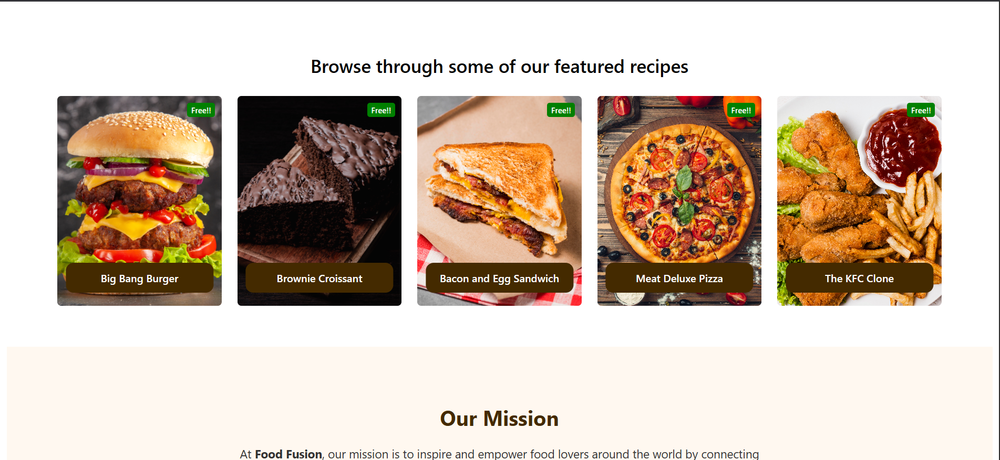
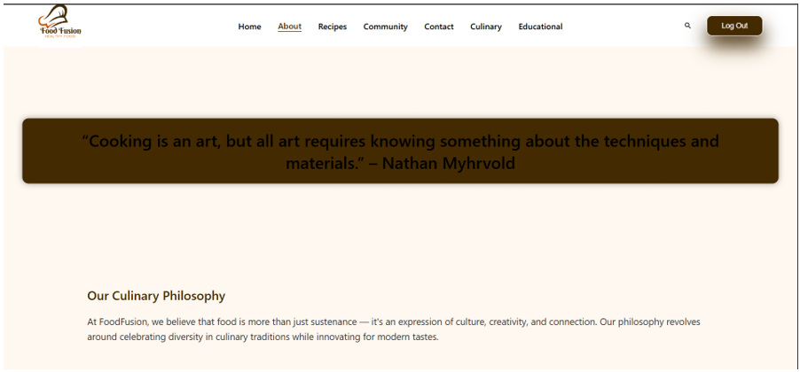

# 🍲 Food Fusion

**Food Fusion** is a modern, full-stack culinary platform where food enthusiasts can **share**, **discover**, and **discuss** recipes. Built using the MERN stack (MongoDB, Express, React, Node.js), it empowers users to contribute their own dishes, browse community recipes, and connect with fellow food lovers.

---

## 🌟 Features

- 👨‍🍳 Add your own recipes with images
- 🔍 Browse and search recipes shared by the community
- ❤️ Like and comment on recipes
- 🔐 User authentication (Sign up / Log in)
- 📁 Store recipes in MongoDB
- 🖥️ Fully responsive across devices

---

## 🛠️ Tech Stack

| Frontend       | Backend         | Database | Other Tools  |
|----------------|-----------------|----------|--------------|
| React          | Node.js         | MongoDB  | Express      |
| Tailwind CSS   | Express Router  | Mongoose | JWT Auth     |

---

## 📸 Screenshots

### 🏠 Home Page

<p float="left">
  
  
  
  
</p>

### 🍽️ Recipes

<p float="left">
  
  
</p>

### 📖 About Page

<p float="left">
  
  
</p>

---

## 🚀 Getting Started

To run this project locally:

### 1. Clone the repository
```bash
git clone https://github.com/yourusername/food-fusion.git
cd food-fusion
