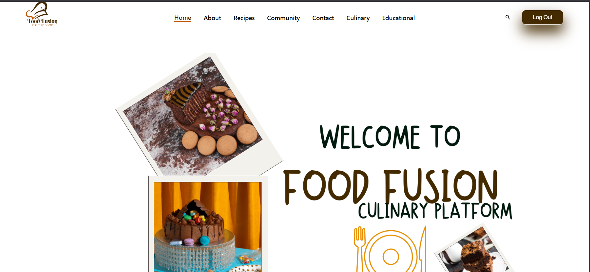

# 🍲 Food Fusion

**Food Fusion** is a modern, full-stack culinary platform where food enthusiasts can **share**, **discover**, and **discuss** recipes. Built with React, Node.js, Express, and MongoDB, it empowers users to contribute their own dishes, browse community recipes, and connect with other food lovers.

---

## 🌟 Features

- 👨‍🍳 Add your own recipes with images
- 🔍 Browse and search recipes shared by the community
- ❤️ Like and comment on recipes
- 🔐 User authentication (sign up / log in)
- 📁 Store recipes in MongoDB database
- 🖥️ Responsive design for all devices

---

## 🛠️ Tech Stack

| Frontend      | Backend         | Database     | Other       |
|---------------|----------------|--------------|-------------|
| React         | Node.js        | MongoDB      | Express     |
| Tailwind CSS  | Express Router | Mongoose     | JWT Auth    |

---

## 📸 Screenshots
```markdown
### 🏠 Home Page
  (./screenshots/home3.png) (./screenshots/home4.png)

### Recipes
 (./screenshots/Recipe2.png)

### 📖 About
 (./screenshots/About2.png)
